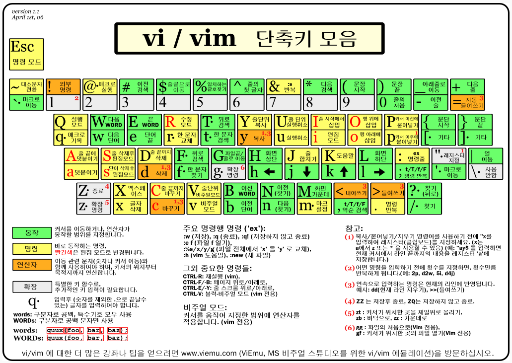

# vi란?
- 전설적인 에디터로 마우스 없이 코드를 편집 할 수 있는 도구다. UNIX를 근원으로 하는 모든 운영체제에 기본적으로 탑재되어 있기 때문에 활용도가 높고, 또 모든 기능이 단축키로 구성되어 있기 때문에 빠른 편집이 가능하다. 단축키를 외우는 것이 어렵다는 진입장벽이 있다. 

# vintage란? 
- Sublime Text에서도 vi의 사용성을 제공하는 패키지다. 기본 탑재되어 있지만 비활성화 되어 있기 때문에 활성화해야 한다. 

# vintage 활성화 방법
- 메뉴 Preference > Settings - Default 를 선택한 후에 아래 코드를 찾는다. 그리고 Vintage를 지워준다.
(만약 적용되지 않는다면 Settings -User 의 내용도 확인한다.)

```
"ignored_packages": ["Vintage"]
아래와 같은 모습이 되야 한다.
"ignored_packages": [""]
```

# vi 기본 사용법 - 입력과 명령 모드 전환
- 명령을 사용하기 위해서는 ESC 키를 누른다. (COMMAND MODE) 
- 편집을 하기 위해서는 'i' 키를 누른다. (INSERT MODE)

# vi 기본 사용법 - 주요 명령
<br />

- 출처 : http://kldp.org/node/102947
- vi 학습 : http://vi.kldp.net/step.html
